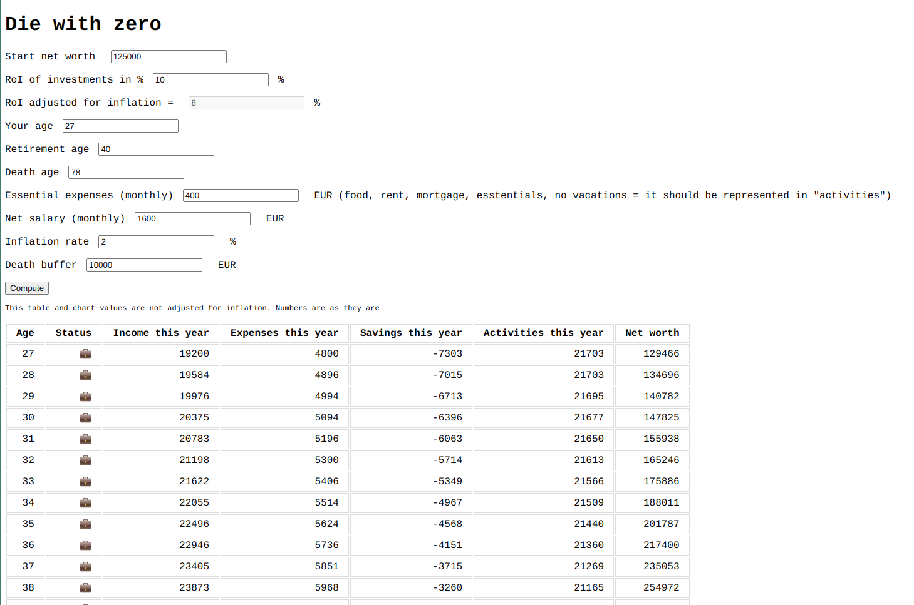

# Die with zero calculator

Open source html page with javascript functionality to compute "diying with zero"

This is purely inspired by this calculator, https://www.diewithzerobook.com/spend-curve-app
However, I wanted to make advanced options, such as input exact amount of income/expenses add death buffer and next others.

# Spending activity

As of now, there's only one activity spending function - linear function.

# How does it look?

# External libraries

1. [alpine.js](https://alpinejs.dev/)
2. [chart.js](https://www.chartjs.org/)
